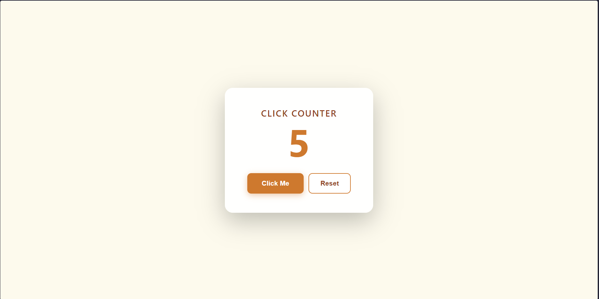

# Click Counter

## 🌟 Overview

A simple and satisfying click counter built with vanilla JavaScript. Click to increment the counter, watch the bump animation, and reset when you're done.

## ✨ Features

*   Increment counter on click
*   Reset counter to zero
*   Bump animation feedback on each click

## 📸 Screenshots & Demos

### Main Interface

_The click counter interface showing the increment button and current count._

## 🛠️ Technologies Used

*   HTML5
*   CSS3
*   JavaScript (ES6)

## 🧠 Learning Outcomes & Challenges

*   DOM manipulation and event handling
*   CSS animations triggered via JavaScript
*   State management in a simple app