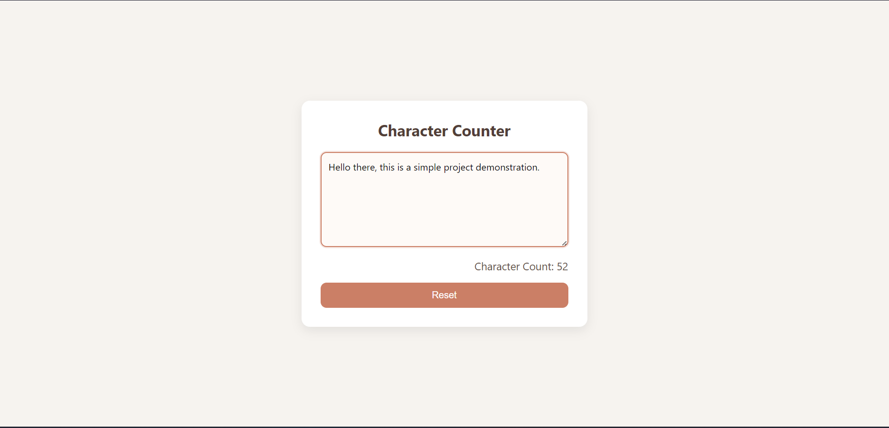

# Character Counter

## 🌟 Overview

A real-time character counter that tracks input length as you type. Provides instant feedback with a clean, minimal interface.

## ✨ Features

*   Real-time character counting as you type
*   Reset functionality to clear input and count

## 📸 Screenshots & Demos

### Main Interface

_The character counter showing live input tracking._

## 🛠️ Technologies Used

*   HTML5
*   CSS3
*   JavaScript

## 🧠 Learning Outcomes & Challenges

*   Handling input events in real time
*   Updating the DOM dynamically based on user input