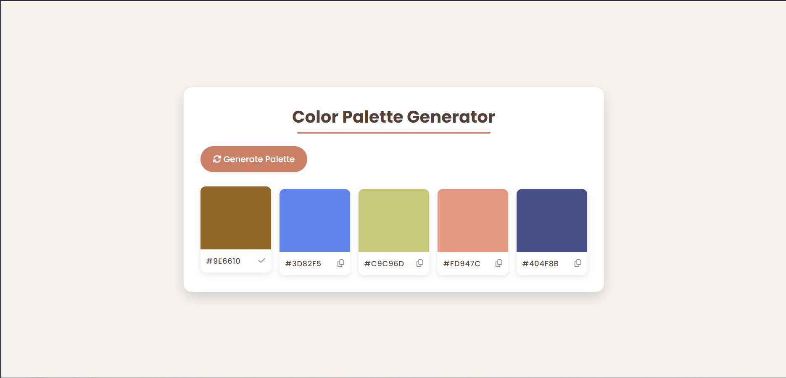

# Color Generator

## 🌟 Overview

A random color palette generator that creates five colors at a time with hex values. Click any color to copy its hex code to your clipboard.

## ✨ Features

*   Generate random color palettes (5 colors at a time)
*   Copy hex values to clipboard with one click
*   Visual color display with hex labels

## 📸 Screenshots & Demos

### Main Interface

## 🛠️ Technologies Used

*   HTML5
*   CSS3
*   JavaScript
*   Font Awesome

## 🧠 Learning Outcomes & Challenges

*   Working with random color generation and hex conversion
*   Clipboard API integration
*   Dynamic DOM rendering