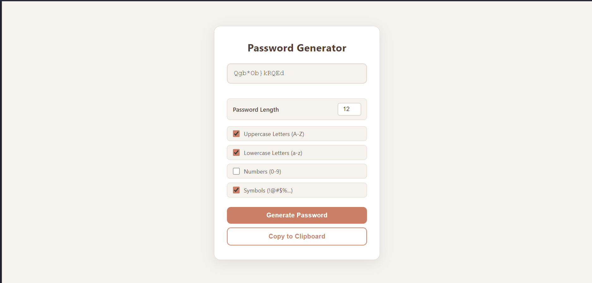

# Password Generator

## 🌟 Overview

A configurable password generator that lets you customize length and character types. Generate strong passwords and copy them to your clipboard instantly.

## ✨ Features

*   Customizable password length (4–30 characters)
*   Toggle uppercase, lowercase, numbers, and symbols
*   Copy generated password to clipboard

## 📸 Screenshots & Demos

### Main Interface

## 🛠️ Technologies Used

*   HTML5
*   CSS3
*   JavaScript

## ▶️ Usage

1. Open `index.html` in any modern browser.
2. Adjust the password length slider and toggle character options.
3. Click generate, then copy the password to your clipboard.

## 🧠 Learning Outcomes & Challenges

*   Password generation algorithms and character set composition
*   Form controls and state management with checkboxes and sliders
*   Clipboard API integration