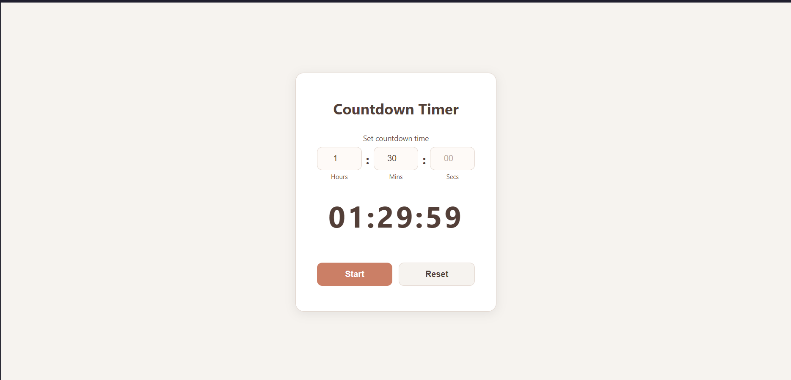

# Countdown Timer

## 🌟 Overview

A clean countdown timer where you set hours, minutes, and seconds, then start the countdown. Includes pause and reset functionality with a formatted time display.

## ✨ Features

*   Set custom countdown duration (hours, minutes, seconds)
*   Start and pause functionality
*   Formatted time display (HH:MM:SS)

## 📸 Screenshots & Demos

### Main Interface

## 🛠️ Technologies Used

*   HTML5
*   CSS3
*   JavaScript

## 🧠 Learning Outcomes & Challenges

*   Working with JavaScript `setInterval` and time calculations
*   Formatting and displaying time values
*   Timer state management (running, paused, reset)