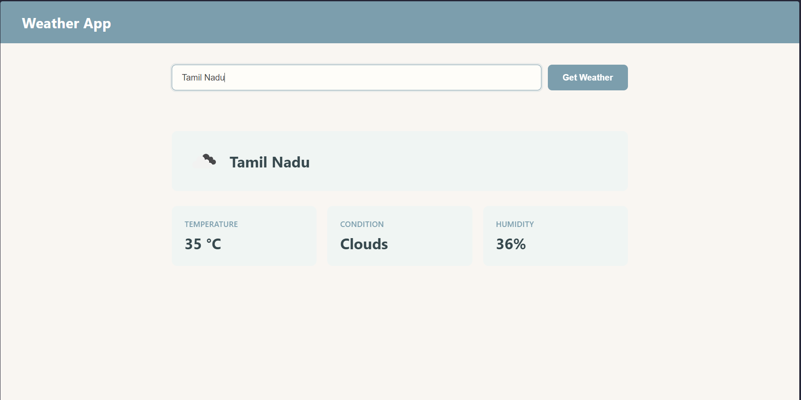

# Weather App

## 🌟 Overview

Search current weather by city name using the OpenWeatherMap API. Displays temperature, weather conditions, humidity, and a weather icon.

## ✨ Features

*   Search weather by city name
*   Displays temperature, condition, and humidity
*   Weather icon display
*   Enter key support for quick search

## 📸 Screenshots & Demos

### Main Interface

_The weather app showing current conditions for a searched city._

## 🛠️ Technologies Used

*   HTML5
*   CSS3
*   JavaScript
*   OpenWeatherMap API

## 🧠 Learning Outcomes & Challenges

*   Using the OpenWeatherMap API
*   Displaying dynamic weather icons
*   Handling API errors for invalid city names