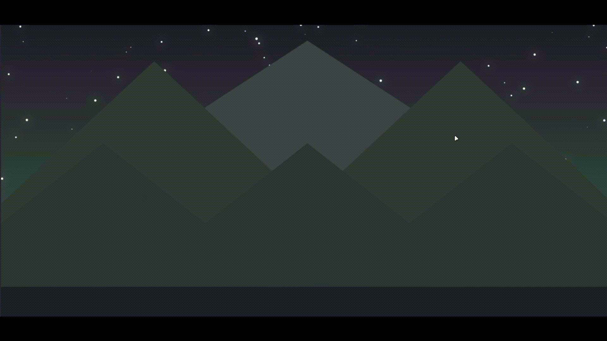

# Star Shower

## 🌟 Overview

Star Shower is an animated HTML5 Canvas project that creates a calm night-sky scene with falling stars, glowing particles, layered mountains, and simple physics-based motion. Stars fall from the top of the screen, bounce with friction, and shatter into smaller particles when they hit the ground or screen edges.

Unlike most projects in this collection, Star Shower uses a Webpack/Babel setup instead of a single plain `script.js` file. This makes it a good example of combining Canvas animation with a more modern JavaScript build workflow.

## ✨ Features

*   Full-screen responsive Canvas scene
*   Randomized falling star generation 
*   Gravity-based vertical motion
*   Friction-based bouncing on impact
*   Shatter effect that creates mini star particles
*   Particle fading using time-to-live and opacity
*   Background star field for depth
*   Layered mountain silhouettes
*   Window resize handling with scene reinitialization
*   Webpack + Babel project structure

## 🎬 Project Demonstration




_The demo should show stars falling, bouncing, shattering into particles, and fading over the mountain landscape._

## 🧩 How It Works

### Star Objects

Each falling star is represented by a `Star` object with position, radius, color, velocity, gravity, and friction values.

*   `velocity.y` controls downward motion.
*   `gravity` accelerates the star as it falls.
*   `friction` reduces bounce intensity after collision.
*   `shatter()` reduces the star radius and spawns smaller particles.

### Mini Stars

`MiniStar` objects are spawned when a main star collides with the ground or wall. They inherit the base star behavior but use:

*   Smaller radius
*   Randomized velocity
*   Lower gravity
*   Time-to-live countdown
*   Gradual opacity fade

### Scene Rendering

The animation loop uses `requestAnimationFrame()` to continuously redraw the scene:

1. Paint the vertical background gradient.
2. Draw static background stars.
3. Draw layered mountain ranges.
4. Draw the ground plane.
5. Update active falling stars.
6. Update mini star particles.
7. Spawn new stars at randomized intervals.

## 🛠️ Technologies Used

*   HTML5
*   HTML5 Canvas API
*   JavaScript
*   Webpack
*   Babel
*   BrowserSync

## 📁 Project Structure

```text
22 Star-Shower/
├── src/
│   ├── index.html
│   └── js/
│       ├── canvas.js
│       └── utils.js
├── dist/
│   ├── index.html
│   └── js/
│       └── canvas.bundle.js
├── package.json
├── webpack.config.js
└── README.md
```

## 🚀 Run Locally

```bash
npm install
npm start
```

The Webpack configuration runs in watch mode and serves the built `dist` folder through BrowserSync at:

```text
http://localhost:3000
```

## 🧠 Learning Outcomes & Challenges

*   Building a continuous Canvas animation loop with `requestAnimationFrame()`
*   Simulating simple motion using velocity, gravity, and friction
*   Handling collision against screen boundaries and the ground
*   Creating particle effects from object collisions
*   Managing object arrays for active stars and fading particles
*   Drawing layered background scenery directly on Canvas
*   Using Webpack and Babel to bundle a modular JavaScript Canvas project
*   Reinitializing Canvas dimensions and scene state on browser resize


